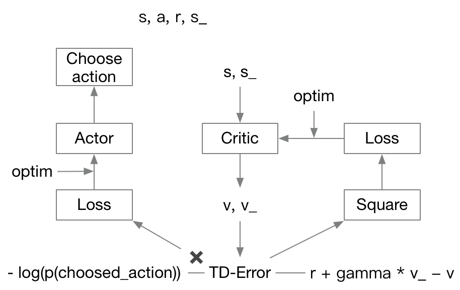

# Actor Critic

## 简介

Actor网络用来做决策，类似于Policy Gradient选择动作，而Critic网络用来帮助Actor网络进行更新，起到了Policy Gradient中reward的作用。两者合二为一可以解决Policy gradient算法必须等到episode结束才能更新的问题。

## 框架

* Critic网络的更新需要state、reward，输入state，输出value
* Actor网络的更新需要state、action、td-error（为Critic网络的输出），输入state，输出动作的概率分布

每步episode流程：

1. 对环境$s$，actor依据概率分布选择动作$a$，得到$s_\_$、$r$
2. 将$s$、$s_\_$输入进Critic网络，得到$v$、$v_\_$，依据图中的公式计算td-error，并用td-error的平方作为loss更新Critic网络
3. 将td-error与Actor网络输出分布与真实标签的交叉熵相乘，作为loss来更新Actor网络

## 问题

1. 网络难以收敛
2. Critic的学习率要比Actor网络稍大
