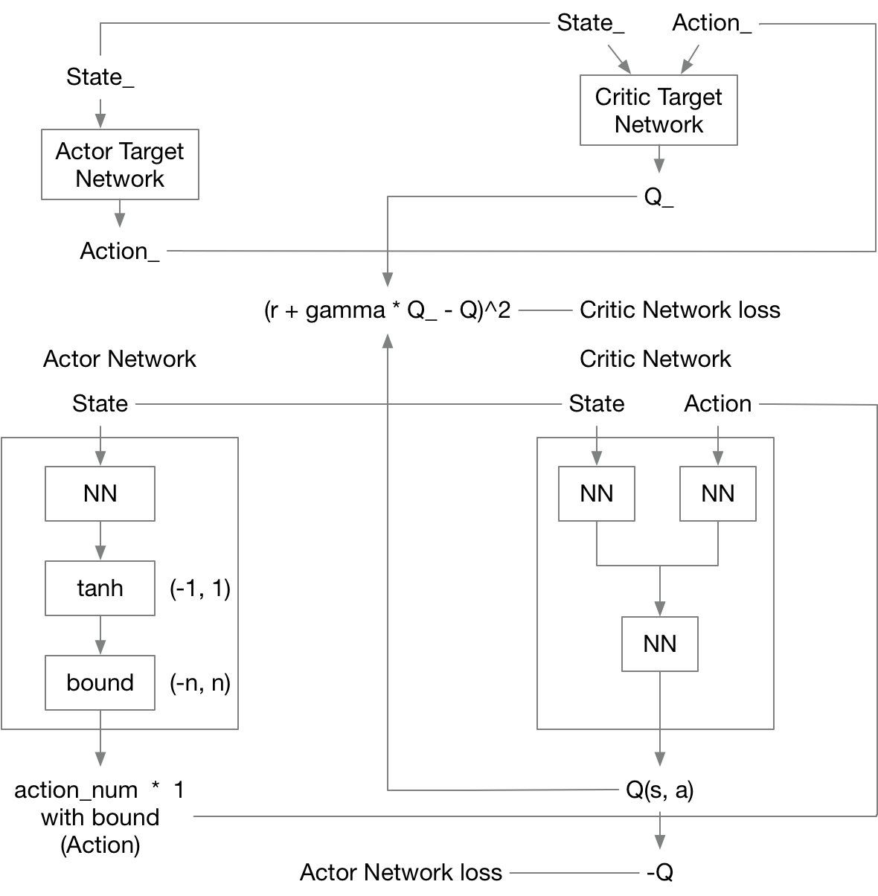

# DDPG

## 简介

Actor：最大化Q值，输出action，而action则可以用tanh映射到(-1, 1)之后加bound，则可进一步映射到任意范围，这样可以输出连续动作  
Critic：根据Q(s,a)函数的贝尔曼方程更新梯度, 输出Q值  
DDPG的Actor网络与Critic网络均有eval与target分别，这就是体现DDPG中Actor-Critic与DQN结合的部分  

## 框架

最简易DDPG的框架可以这样实现：

每个episode流程：

1. DDPG选择一个动作，环境执行动作，执行的动作可以通过正态分布加上随机性（以原动作为中心，方差可在开始定得较高，随着episode上升而下降，加上随机性后的动作注意不能溢出），得到$s$, $a$, $r$, $s\_$，存入经验池中
2. 经验池超过阈值以后开始训练，随机选batchsize个，经验池更新同DQN
3. 更新Actor网络：$loss = -\frac{1}{Batchsize}*Q$
4. 更新Critic网络：$Q_{target}=r + \gamma*Q\_$，$loss = (Q_{target}-Q)^2$  

## 问题

1. DDPG中两个target网络是不能被训练的，更新只能通过DQN的参数复制方式更新，普通DQN是隔一段时间全复制一次，而DDPG可以进行soft更新，即每一个step将eval net的参数按比例复制一部分过去，这样可以提高稳定性

## 论文

1. [论文链接](https://arxiv.org/abs/1509.02971)
