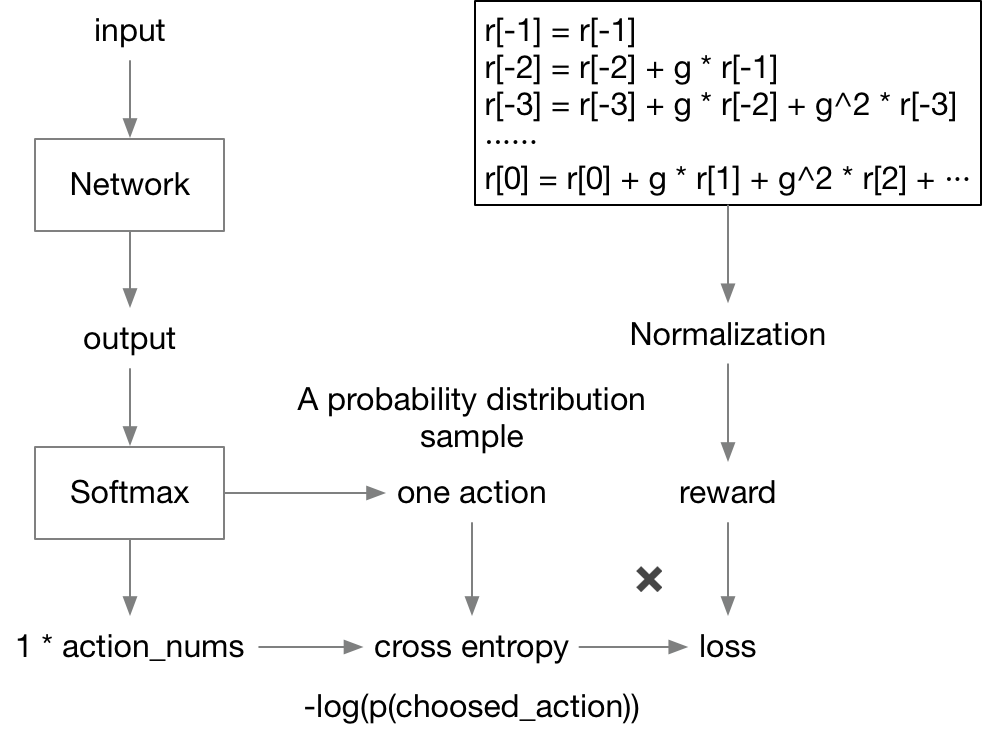

# Policy Gradient

## 简介

基于策略的算法  
  

## 框架

一个episode的操作如下：  

1. 输入state，输出经过Softmax之后为不同动作的概率
2. 依据概率选择一个动作
3. 环境执行动作，得到reward
4. 将这一组s, a, r存入经验池中

更新的操作如下（同episode分离）：

1. 将一个完整episode的reward进行衰减操作，具体操作如黑框中代码
2. 将这些reward进行Normalization操作，加快训练
3. 对每一步的s, a, r(已经过norm)，网络输入o得到的action概率同前向计算时相同（因为模型此时还没有被训练），用这个概率分布与a为标签的one-hot向量计算交叉熵，交叉熵再乘上这一步的reward作为loss反向传播
4. 显然每一组loss的值为$-r^\prime\log(P_{choosed\_action})$
5. reward可以理解为更新的强度，若reward不好则表示不向梯度下降的方向更新太多，甚至reward为负数时可以向反方向更新

## 问题

1. 更新必须等到episode结束，效率太低
